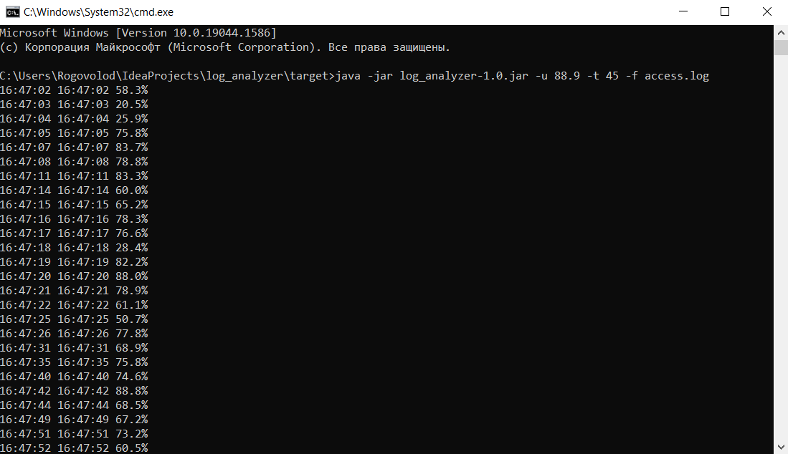

# Log Analyzer

Программа для анализа логов веб-сервера. Находит временные интервалы, в которых уровень доступности ниже заданного порога.

## Использование

### Сборка
Соберите программу с помощью `mvn`:
```bash
mvn clean package
```

### Запуск
Программа поддерживает следующие параметры:

- `-u`: минимальный допустимый уровень доступности (в процентах, например, 99.9)
- `-t`: максимальное допустимое время ответа (в миллисекундах, например, 45)
- `-f`: путь к файлу лога (опционально)

### Пример использования

**Чтение из файла:**
```bash
java -jar log_analyzer-1.0.jar -u 88.9 -t 45 -f access.log
```


### Пример вывода
```
13:32:26 13:33:15 94.5%
15:23:02 15:23:08 99.8%
```

### Требования
- Java 17 или выше
- Файл лога должен соответствовать формату:
```
192.168.32.181 - - [14/06/2017:16:47:02 +1000] "PUT /rest/v1.4/documents?zone=default&_rid=6076537c HTTP/1.1" 200 2 44.510983 "-" "@list-item-updater" prio:0
```

### Демонстрация успешной работы программы

